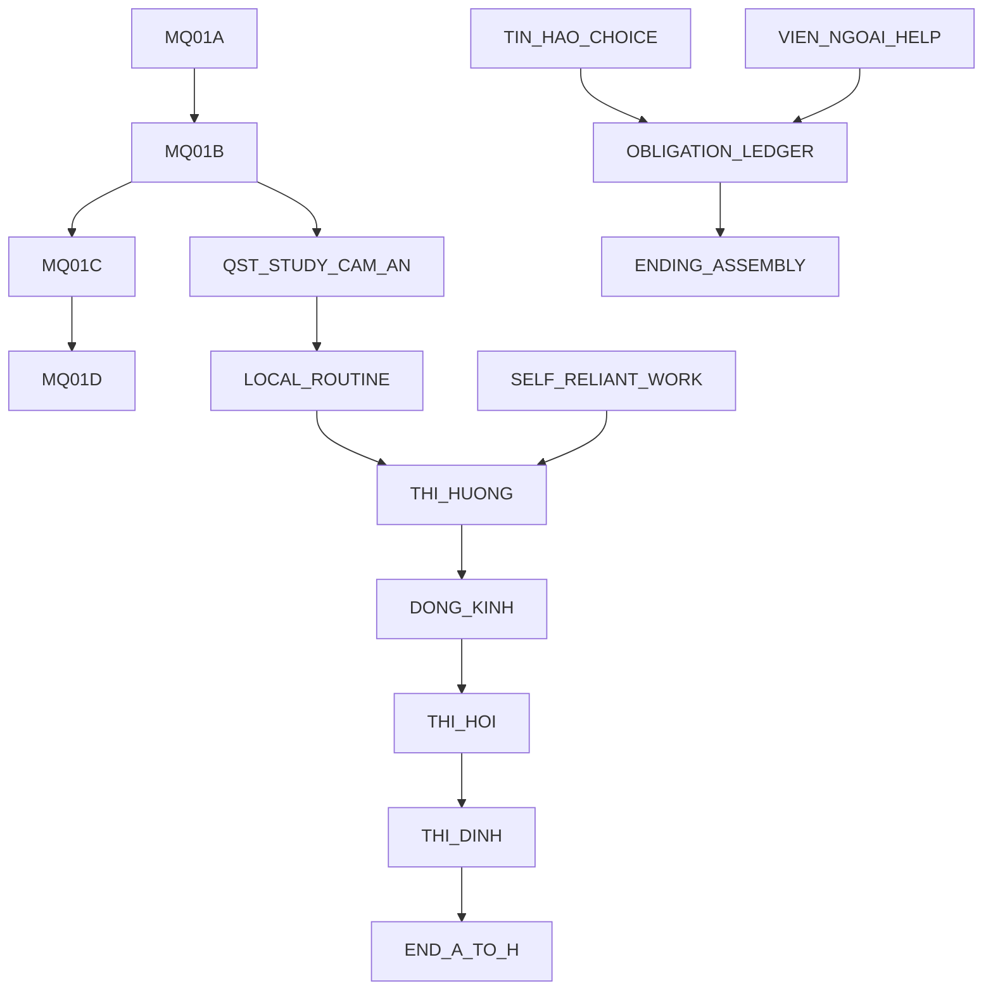

# Story–Quest System Map

## Chapter 1 spine
Dramatic question: can Lâm pursue công danh without letting hunger, documents, debt and patronage make him someone he does not recognize? Premise: Hồng Đức 14-15 (1483-1484), a 260-day compressed path from Kinh Bắc village life through Thi Hương, Thi Hội, Thi Đình and a Thái Học hook. Theme: chữ nghĩa is power only when bounded by responsibility.

## 260-day arcs
| Arc | Days | Function | Point of no return |
|---|---:|---|---|
| Opening/MQ01 | 1-5 | kê danh, bảo kết, DOC01 greybox, Cẩm An notices restraint | MQ01 report submitted |
| Local survival | 6-60 | jobs, mother, Tín/Hào, Bà Ba, study routine | leave for exam prep hub |
| Thi Hương prep/result | 61-110 | demonstrate life-state impacts | exam submission |
| Travel/East capital entry | 111-180 | widen obligations and document stakes | enter Đông Kinh track |
| Thi Hội/Đình | 181-245 | exam interface and Văn sách synthesis | final clean record checked |
| Ending assembly | 246-260 | END-A..END-H fate/moral/coda/route precedence | ending selected |

## Dependency graph

Missed quests rejoin through routine summary or later callback unless marked exam submission or ending assembly point-of-no-return.

## Character arcs and knowledge
| Character | Wants | Believes | Hides/withholds | Arc movement |
|---|---|---|---|---|
| Lâm | sit exams and keep dignity | words can protect people | fear poverty will decide for him | from reactive son to accountable scholar |
| Cẩm An | test whether Lâm knows limits | restraint matters more than flourish | full past of failed petition | opens study/thúc tu after MQ01 restraint |
| Tín | keep Lâm safe | public virtue can be dangerous | shortcuts known through informal ties | warns or supports with costs |
| Hào | convert chaos into advantage | systems bend for those who dare | personal debt exposure | offers risky help/reputation changes |
| Mẹ Lâm | preserve family survival | health matters before rank | sacrifices food/money | anchors fail-forward dignity |
| Viên ngoại | bind talent into patronage | help should create loyalty | true expected repayment | route aid with obligation trap |

## Mystery/reveal ledger
| Clue | Appears | Acquisition | Allowed conclusion | False lead | Payoff |
|---|---|---|---|---|---|
| DOC01 greybox marks | MQ01A | inspect/compare | needs further comparison, not “proved fake” | Lâm can overclaim | Cẩm An trusts restraint |
| witness mismatch | MQ01B | ask/compare | testimony conflicts | debt = automatic disqualification | delayed bảo kết decision |
| patron gift terms | local survival | accept help | obligation has source/due/amount | free money | ending moral/coda callback |

## Choice-memory matrix
| Choice | Variable | Short feedback | Callback/coda | Rejoin |
|---|---|---|---|---|
| cautious MQ01 conclusion | mentor_trust, integrity | Cẩm An notices limits | unlocks study tone | MQ01D |
| poetic/overclaim | village_reputation up, integrity risk | crowd reaction | QA flag for overclaim | MQ01D with penalty |
| accept Viên ngoại help | obligation list, relation_vien_ngoai | money rises, morale cost | Bẫy Ân Nghĩa coda | routine continues |
| self-reliant work | job mastery, money | exhaustion visible | labor identity coda | routine continues |

## Ending precedence
Hard fail-forward routes resolve before prestige: survival/fate, exam eligibility/clean record, exam rank, obligation unresolved, moral method, route-specific coda, Thái Học hook. END-A..END-H remain GDD v22 source labels pending owner-approved final code names.

## Scope budget
True divergence: accept/refuse major patronage; exam pass band; clean record. Rejoin with consequences: MQ01 choices, Tín/Hào involvement, job route. Tone/info only: many dialogue choices and optional clue order.

## Day 1-18 implementation briefs
| ID | Time/node | Goal | Narrative/gameplay purpose | Setup/authority | Beats/verbiage intent | Preconditions | Choices/checks | Reads | Writes | Feedback/consequence/callback | Fail-forward/rejoin | Claim/constraint | UI | Assets/audio | Telemetry | QA |
|---|---|---|---|---|---|---|---|---|---|---|---|---|---|---|---|---|
| MQ01A | Day 1 đạo sở | verify Lâm record | introduce bảo kết and document verbs | quan sở tại/xã trưởng; Lâm no authority | hear accusation, inspect DOC01, compare marks; placeholder tone formal, no faux archive text | quest available | cautious/poetic/silent; Minh sát optional | item_DOC01, alertness | mentor_trust, evidence flag | Cẩm An notices restraint or overreach | delayed file; MQ01B | MQ01-E01-E04, DOC01 greybox | dialogue + document panel | greybox paper icon only | mq01_evidence_inspected | DOC01 not more specific than QA allows |
| MQ01B | Day 1 đạo sở | ask witness | teach testimony vs document | witness can answer, not adjudicate | ask, pin contradiction, select conclusion level | MQ01A active/completed | locked overclaim if evidence low | evidence flags | village_reputation/integrity | “needs đối chiếu” accepted | MQ01D opens day 3-5 | MQ01-E03-E15 | clue book | no final voice | mq01_conclusion_selected | conclusion cap enforced |
| QST_STUDY_CAM_AN | Days 2-18 school | open study/thúc tu | unlock XP loop | Cẩm An offers constrained mentorship | study, pay small fee, receive feedback | available | study/rest/work tradeoff | money, alertness | XP Văn sách, mentor_trust | rank progress visible | can work if poor | fiction bounded by mentor role | study book | greybox desk | xp_gained | no relation-to-exam direct bonus |
| JOB_COPYIST | Days 2-18 market | earn via chữ | show labor progression | Bà Ba brokers first jobs | accept, perform, quality result | alertness >=25 | direct-call locked until mastery | stats, mastery | money, mastery, rep | broker fee shown | safety-net alternative | fiction job, no historical overclaim | job board | paper stack | job_resolved | broker fee only when eligible |
| JOB_MARKET_CARRY | Days 2-18 market | survive when poor | safety net | market labor | accept, perform, fatigue | health >=18 | no skill check | health | money, fatigue | lower pay, reliable | forced rest if collapse | creative | job board | basket icon | job_resolved | self-route can continue |
| ROUTINE_3DAY | Any unlocked day | plan nine canh | demonstrate compressed loop | player owns schedule | select actions, draw 3 cards, confirm, resolve summary | not story-locked | routine <=9 | actions/state | all state deltas | top five changes + details | cancel before confirm | system fiction | routine builder | greybox | routine_resolved | no >9 slots |
| OPP_TIN_HAO | Days 1-18 market | choose social risk | show Tín/Hào obligation vector | peers have no official authority | three cards, choose one | eligible conditions | group uniqueness | seed, day | relation/money/integrity | short callback | unchosen expires/logged | creative | opportunity cards | portraits greybox | opportunity_drawn | same seed same cards |
| HELP_VIEN_NGOAI | Days 1-18 estate | accept/refuse aid | Bẫy Ân Nghĩa | patron can lend, not only path | show terms, confirm | action available | confirmation required | money, obligations | money, relation, obligation | ledger due visible | self-route remains | creative constraint | obligation screen | seal placeholder generic | obligation_added | obligation has source/due |
