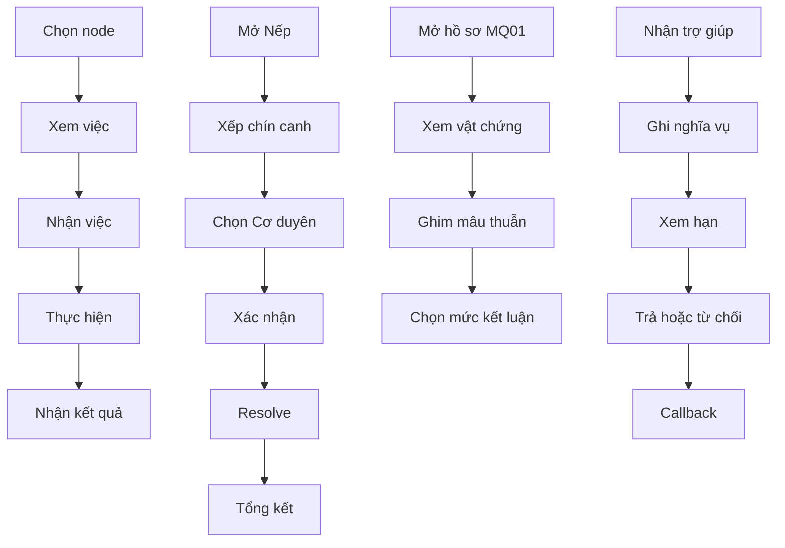

# UX/UI Interaction Spec

All screens support mouse, keyboard and controller focus; text scaling, contrast, and non-color signaling follow XAG 101/107/114. No screen requires speed input or long hold without an option. Disabled actions show a reason.

| Screen | Entry | Goal | Visual priority | Reads | Interactions/commands | Enabled/tooltip | Overlay/return | Confirm | Feedback | Empty/error | Telemetry | Acceptance |
|---|---|---|---|---|---|---|---|---|---|---|---|---|
| Main menu/load/continue | boot/pause | start safely | Continue, Load, New | save slots | press Continue/Load/New | disabled if no save | returns to last node | overwrite new game | load spinner/error | corrupt save recovery | save_loaded | corrupt save does not crash |
| Node HUD | after load | choose location/action | date, canh, 3 stats, money | state/actions | click node/action | requirements tooltip | back to map | no | immediate stat preview | no actions message | node_opened | focus restores |
| Sổ việc | HUD | inspect jobs | available jobs/pay/fee | jobs/state | accept job command | broker/direct reason | job detail | job confirm | pay/cost preview | no jobs fallback | job_viewed | copyist + safety net visible |
| Nếp builder | HUD | fill nine canh | slots then risk | actions/state | add/remove/confirm | over-cap reason | opportunity draw | confirm resolve | predicted cost | story locked | routine_built | cannot exceed nine |
| Cơ duyên | Nếp confirm | choose one of three | cards, group, expiry | opportunities | choose card | ineligible hidden in log | detail overlay | confirm choice | selected effect preview | fewer than 3 reason | opportunity_drawn | same seed same order |
| Bảng kết Nếp | after resolve | understand changes | top five deltas | StateDelta | expand details | n/a | back HUD | no | events/telemetry shown | no-change message | routine_resolved | details accessible |
| Sổ học | HUD | see XP/rank/perks | skill bars | skills/balance | select skill/perk | perk lock reason | skill detail | no | rank-up banner | no XP state | xp_screen_opened | no XP spend for perk |
| Sổ manh mối | HUD/MQ01 | track clues | pinned contradictions | quest/items | pin/unpin/select conclusion | evidence cap tooltip | DOC panel | conclusion confirm | allowed conclusion | no clue state | clue_pinned | DOC01 greybox visible |
| Hành trang | HUD | use/sell items | quest items separated | items | use/sell/pawn | quest item cannot sell | item detail | sell confirm | money/effect | empty bag | item_action | DOC01 sale blocked |
| Địa đồ | HUD | travel/select node | current node routes | map/state | select node | travel lock reason | node panel | no | cost preview | unreachable | map_node_selected | keyboard path works |
| Sổ nghĩa | HUD | inspect obligations | due/source/repay | obligations | repay/refuse | insufficient money reason | obligation detail | repay/refuse confirm | coda risk | no debts | obligation_viewed | source and due shown |
| Dialogue/choice | quest | choose response | speaker, intent, choices | quest/state | select choice | locked choice reason | clue/item overlay | irreversible choices | short feedback | no choices fallback | choice_selected | no faux historical dialogue required |
| MQ01 document greybox | Sổ manh mối | compare evidence | document zones/clues | DOC01 flags | inspect/compare/pin | conclusion cap | evidence detail | final conclusion | contradiction pin | asset lock warning | mq01_evidence_inspected | no layout/seal/detail overclaim |
| Pause/settings/save | any | control session | resume/save/settings | save/options | save/load/remap/text scale | autosave status | modals | overwrite confirm | saved/error | corrupt recovery | settings_changed | remap and text scale accessible |

## Mermaid flows

